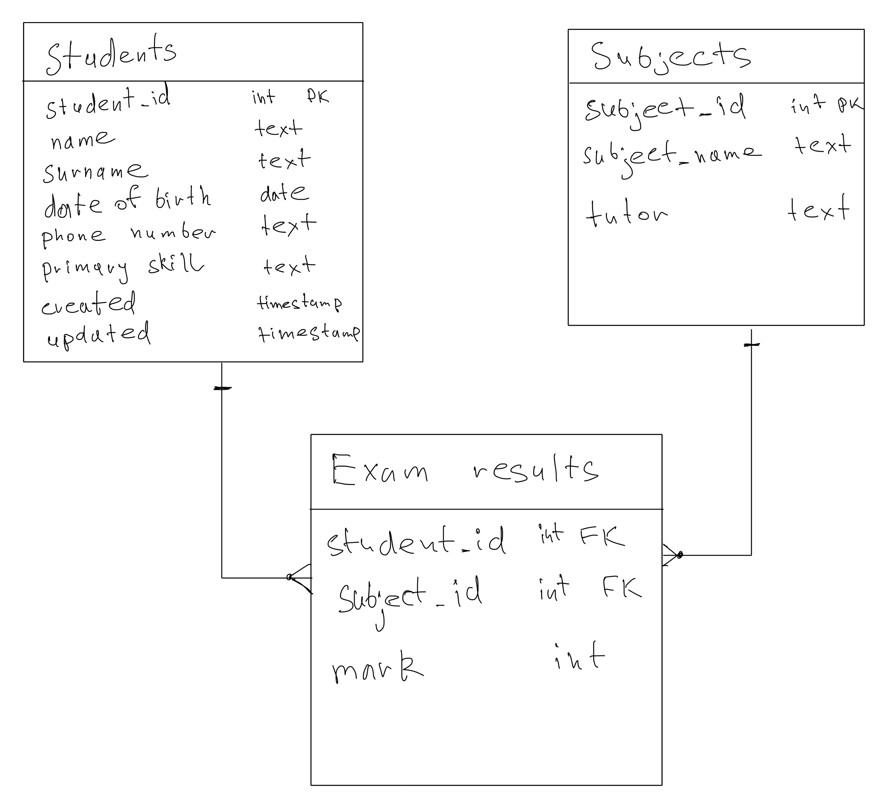

# Module 4: databases

## This module demonstrates database modelling for the univercity

## Design

Let's design the simple database with 3 tables: students, subjects and exam_results. Students and Subjects tables both has id as the primary key which is foreign key in Exam results table and demonstrates one-to-many relationship, so each result can be identified by participating of single student in single subject. 

Let's create physical model of the database in postgress. SQL for tables creation can be checked in [create_db.sql](create_db.sql)